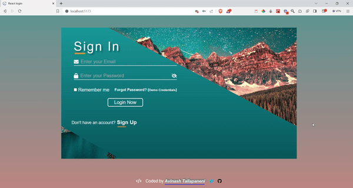

# Talloger

## Introduction

**Talloger** is a basic authentication webpage which utilized ***Regex*** and states to validate the form fields

## Upcoming Features

- Authentication usign **Msal/Firebase**.
- Main content page after Login/Registration.
- **Redux/Context API** for managing states
- Database integration using **mongoDb**

## Technologies Used

- React.js: JavaScript library for building user interfaces
- React Router: Routing library for handling navigation in React apps
- Tailwind CSS: Utility-first CSS framework for styling components

## Screenshot

### Desktop version



## Getting Started

To get started with the Cine Spectrum app, follow these steps:

1. Clone the repository:

   ```bash
   git clone <repository-url>
   ```

2. Install the dependencies:

   ```bash
   npm i

   ```

3. Start the development server:

   ```bash
   npm run dev
   ```

4. Click on the host link in Terminal to access the ***Talloger***.

# Folder Structure

The project structure is organized as follows:

- **src**: Contains the source code of the Talloger.
- **components**: Contains reusable components used throughout the app.
- **pages**: Contains the main pages of the app.
- **App.js**: The main component that renders the app.
- **index.js**: The entry point of the app.

# Contributing

Contributions to the Cine Spectrum app are welcome! If you find any bugs or have suggestions for improvements, please create an issue or submit a pull request.

## Author

My name is Avinash Tallapaneni, and I am a front-end web developer passionate about creating immersive and engaging user experiences. Talloger is a project that showcases my skills and dedication to building high-quality web applications.

- GitHub - [Your GitHub Profile](https://github.com/your-profile)
- Twitter - [Twitter Profile](https://twitter.com/TallapaneniAvi)

## Feedback

I appreciate any feedback you have on CineSpectrum. If you have any suggestions, bug reports, or general feedback, please feel free to

# License

This project is licensed under the MIT License.
Feel free to modify the content to match your project and provide additional information as needed.
